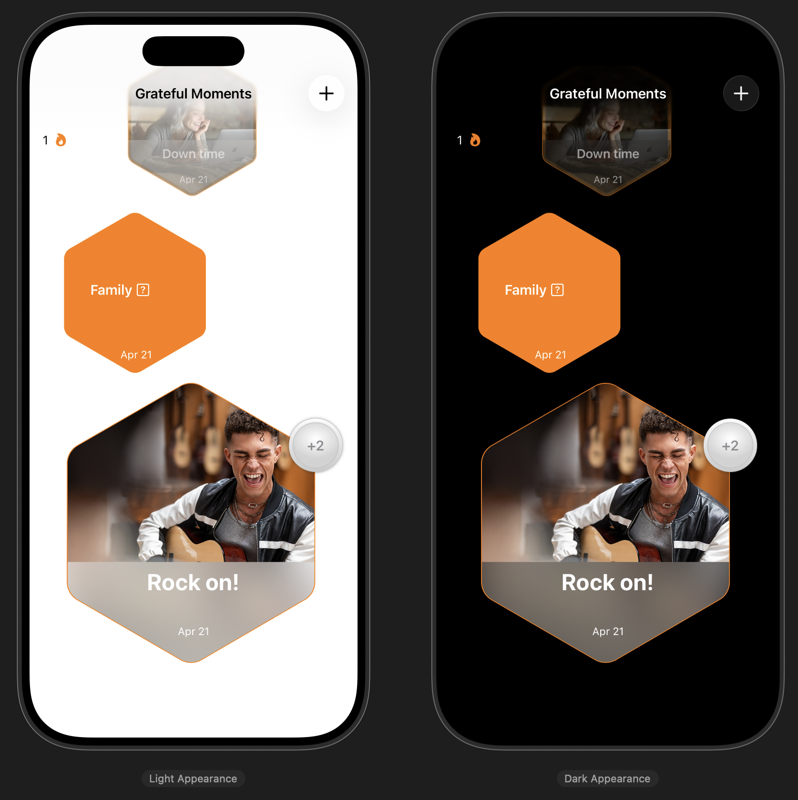
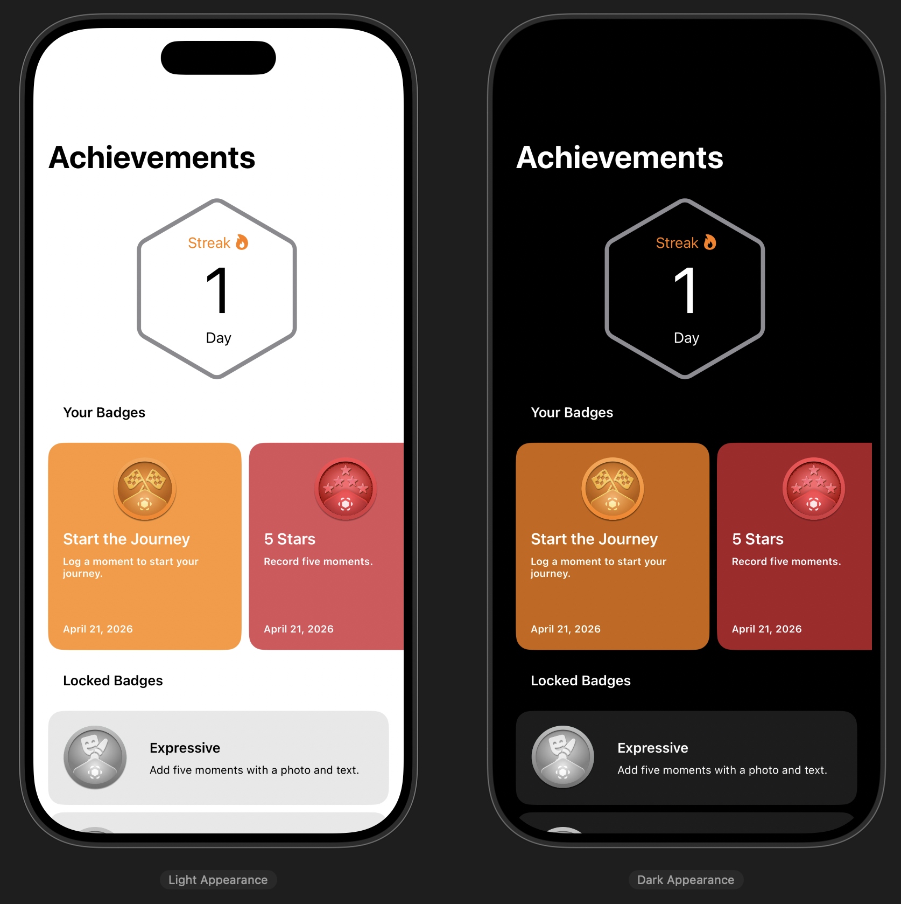
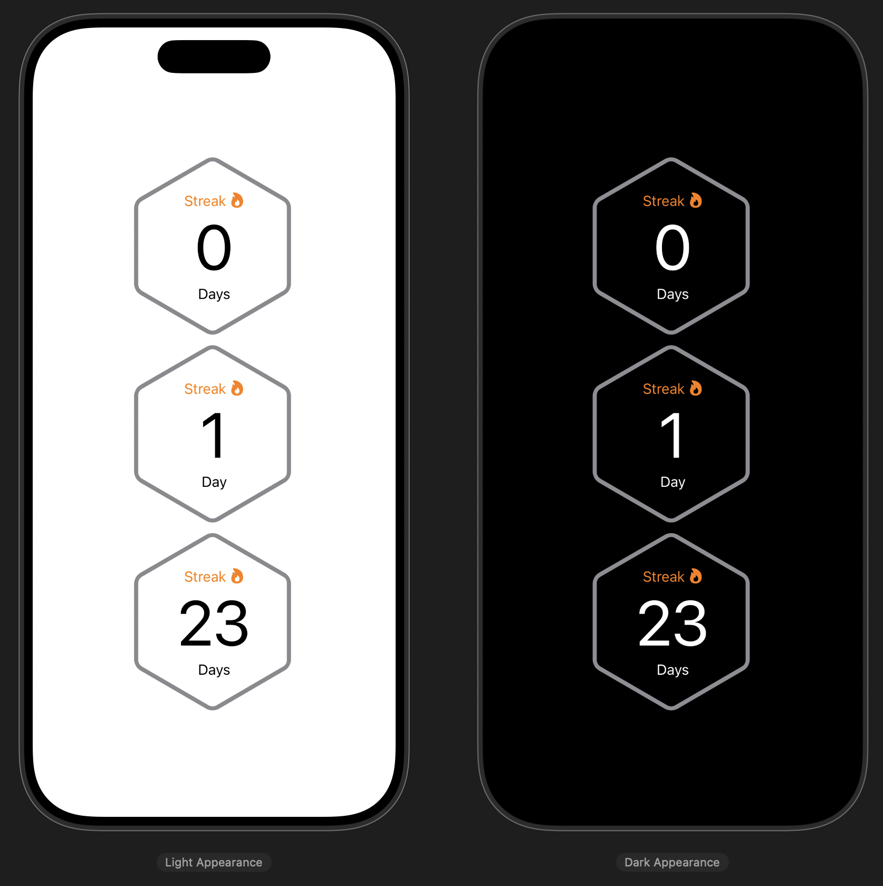

## [App Development] 3-1. App refinement - Add inclusive features
[🔗 link](https://developer.apple.com/tutorials/develop-in-swift/add-inclusive-features)

- 라이트모드 / 다크모드
### .minimumScaleFactor
- to allow the text to scale down when the font and layout would otherwise require truncation.
- Text 뷰의 텍스트가 지정된 프레임을 벗어나지 않도록, 폰트 크기를 자동으로 줄여주는 modifier

### locale
Information about linguistic, cultural, and technological conventions for use in formatting data for presentation.
- 사용자의 언어, 국가, 그리고 문화적 관습을 담고 있는 설정꾸러미 -> localization!

### .dynamicTypeSize
specifies how large scalable content should be.

---
## Preview

  
  
  

---
## [App Development] 3-2. App refinement - Investigate and fix a bug
[🔗 link](https://developer.apple.com/tutorials/develop-in-swift/investigate-and-fix-a-bug)

### Unit Test
- 함수, 메소드 등 최소 단위의 코드가 의도대로 정확히 동작하는지 검증하는 자동화된 절차

