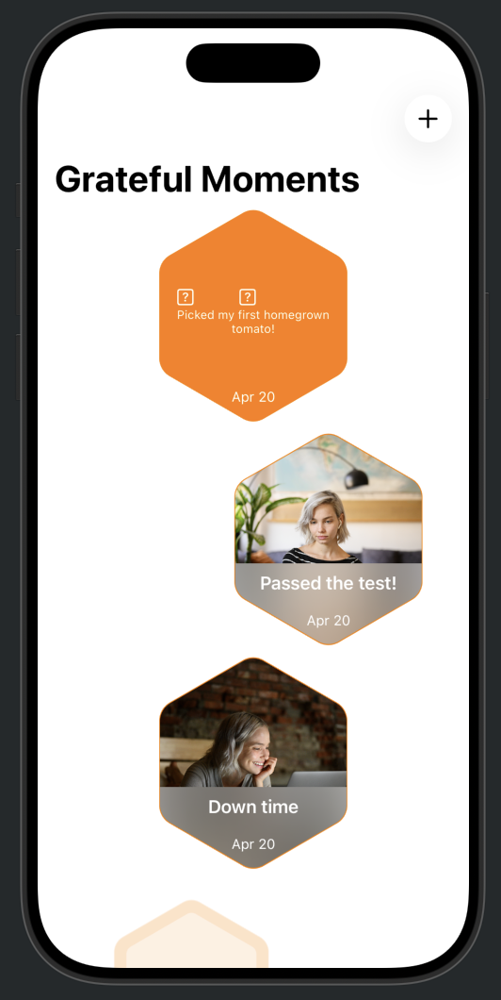
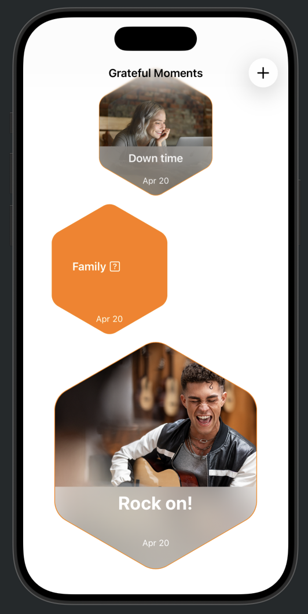
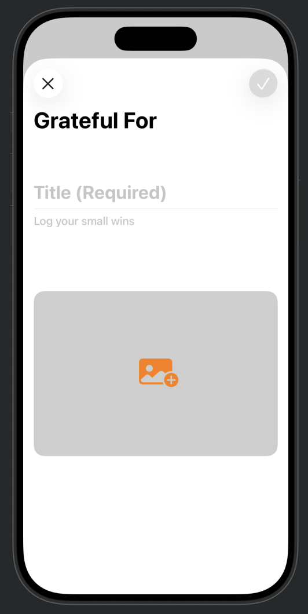
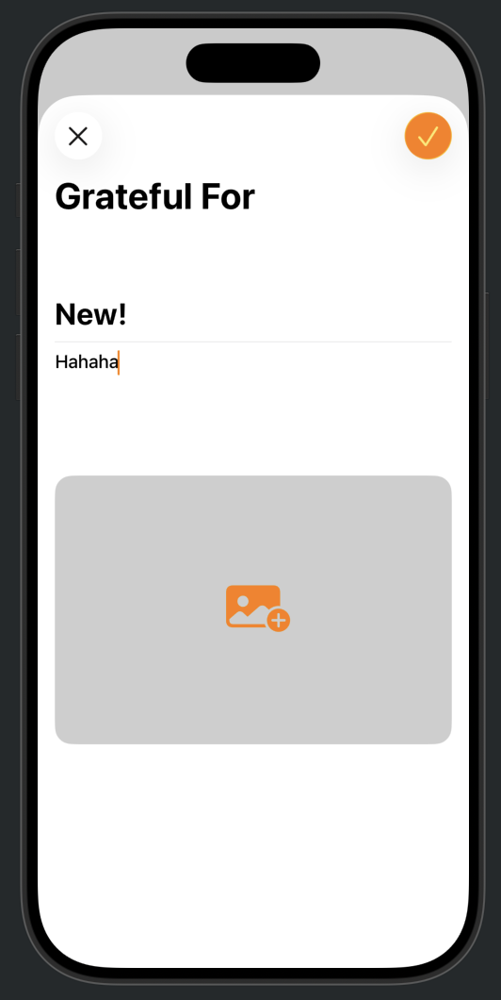
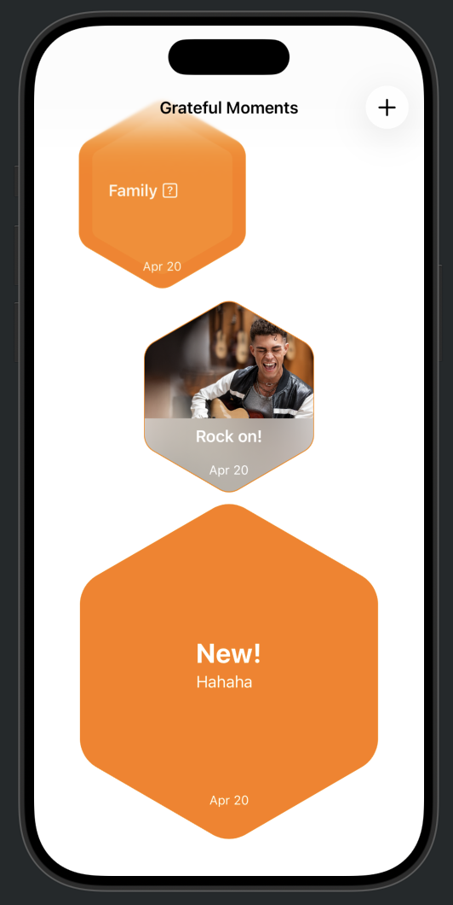
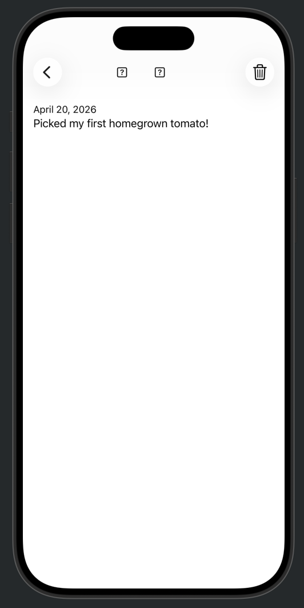
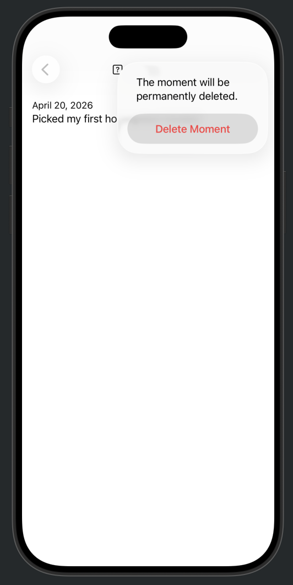

## [App Development] 1-1. Views and data storage - Collect, model, and store data
[🔗 link](https://developer.apple.com/tutorials/develop-in-swift/collect-model-and-store-data)


### .scrollDismissesKeyboard
키보드가 화면 밖으로 스크롤될 때 키보드 숨기기


### PhotoPicker
```
import PhotosUI

@State private var imageData: Data?
@State private var newImage: PhotosPickerItem?

private var photoPicker: some View {
        PhotosPicker(selection: $newImage) {
            Image(systemName: "photo.badge.plus.fill")
                .font(.largeTitle)
                .frame(height: 250)
                .frame(maxWidth: .infinity)
                .background(Color(white: 0.4, opacity: 0.32))
                .clipShape(RoundedRectangle(cornerRadius: 16))
        }
    }
```

- The loadTransferable function transfers the image from the Photos library into your app in the requested Data format.


---
## Preview
<p align="center">
  
  
  
</p>


---

## [App Development] 1-2. Views and data storage - Use a custom layout view
[🔗 link](https://developer.apple.com/tutorials/develop-in-swift/use-a-custom-layout-view)


``` struct Hexagon<Content: View>: View ```
어떤 종류의 SwiftUI 뷰든 받아들일 수 있도록 제네릭 타입 Content 선언

### @ViewBuilder
이니셜라이저 호출 시 여러 개의 뷰를 나열하거나 조건문을 사용하는 등 SwiftUI 특유의 선언적 문법을 그대로 사용 가능


---
## Preview
<p align="center">
  
  
  
  
  
  
  
      
</p>
