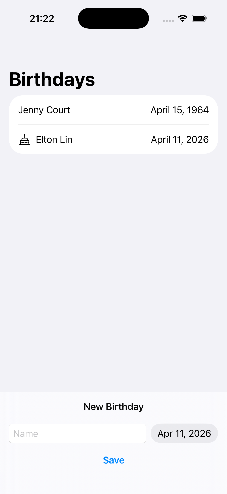
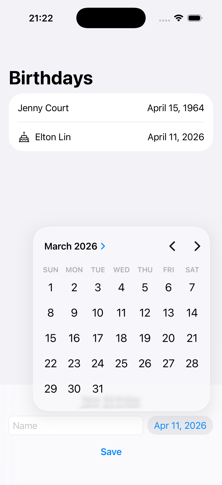
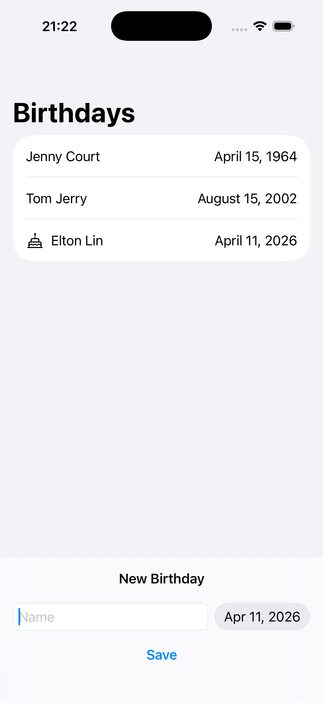

## [Data Modeling] 2. Models and persistence - Save data
[🔗link](https://developer.apple.com/tutorials/develop-in-swift/save-data)

---
### Date
stored as seconds past a fixed reference. The start of the year 1970 is one of those reference dates, known as the Unix epoch.
- **timeIntervalSince1970** : 1970년 1월 1일 자정을 0으로 해서 현재까지의 시간을 초 second로 환산해서 시간을 표현하는 방식

[참고] [Apple Developer Documentation](https://developer.apple.com/documentation/foundation/nsdate/timeintervalsince1970)

### .safeAreaInset
can anchor content to any side of the screen
화면의 어느 쪽이든 콘텐츠 고정 가능

### DatePicker
select a calendar date, and optionally a time
날짜(+시간)을 선택할 수 있는 picker
- **in: Date.distantPast..Date.now** : 먼 과거 ~ 현재까지

### .bar
.bar styles the background in the same style as a system toolbar

### **SwiftData**
- 앱의 데이터 모델링, 영구 저장 기능
- 사용자가 앱을 떠나도 데이터가 사라지지 않도록!
- @Model : Swift 클래스를 SwiftData에서 관리하는 저장 모델로 변환
- class에 있는 built-in identity로 모든 뷰와 모델 데이터 공유 (예제: struct > class 변경)
- **.modelContainer(for: )** 로 SwiftData와 SwiftUI 연결
- **@Query**는 SwiftData에 데이터 배열 요청. SwiftData에 저장된 인스턴스를 업데이트하면 @State 속성처럼 뷰가 업데이트됨
- **ModelContext** : 데이터 추가, 삭제 등의 작업을 수행하는 객체

---
## Preview

  
  
  

