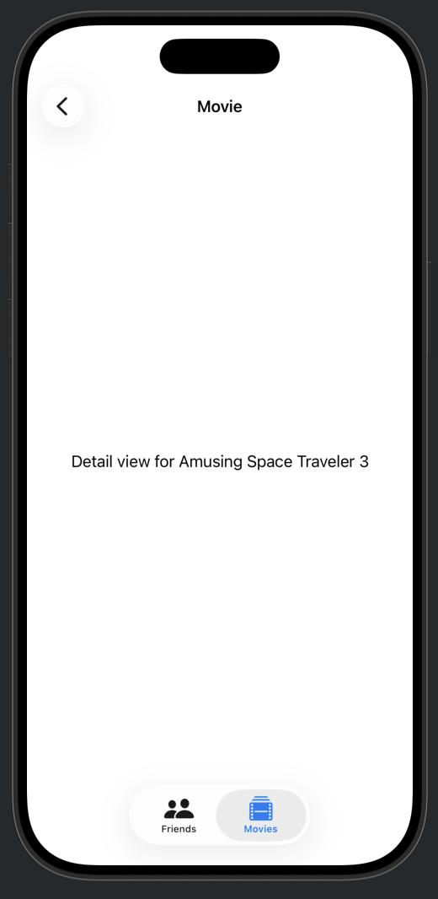

## [Data Modeling] 3-1. Navigation, edting, and relationships - Navigate sample data
[🔗 link](https://developer.apple.com/tutorials/develop-in-swift/navigate-sample-data)

---
### Schema
An object that maps model classes to data in the model store, and helps with the migration of that data between releases.
- 앱의 데이터 구조를 정하고, 나중에 구조가 바뀌어도 데이터를 안전하게 옮겨주는 역할
- 데이터베이스의 그 스키마! SwiftData Schema는 마이그레이션까지 자동으로 관리.
[참고] [Apple Developer Documetation](https://developer.apple.com/documentation/swiftdata/schema)

### @MainActor
With this annotation, you’re declaring that all code in this class must run on the main actor, including access to the mainContext property. Since all the SwiftUI code in an app runs on the main actor by default, you’ve satisfied the condition.
- 이 클래스의 모든 코드가 mainContext 속성에 접근하는 것을 포함하여 메인 액터에서 실행되어야 함을 선언.

### timeIntervalSinceReferenceDate 
2001년 1월 1일 00:00:00 UTC 기준

### NavigationSplitView
A view that presents views in two or three columns, where selections in leading columns control presentations in subsequent columns.
- 2개 혹은 3개의 칼럼으로 표시하는 화면
[참고] [Apple Developer Documetation](https://developer.apple.com/documentation/SwiftUI/NavigationSplitView)

---

## Preview

  
  
  
  

