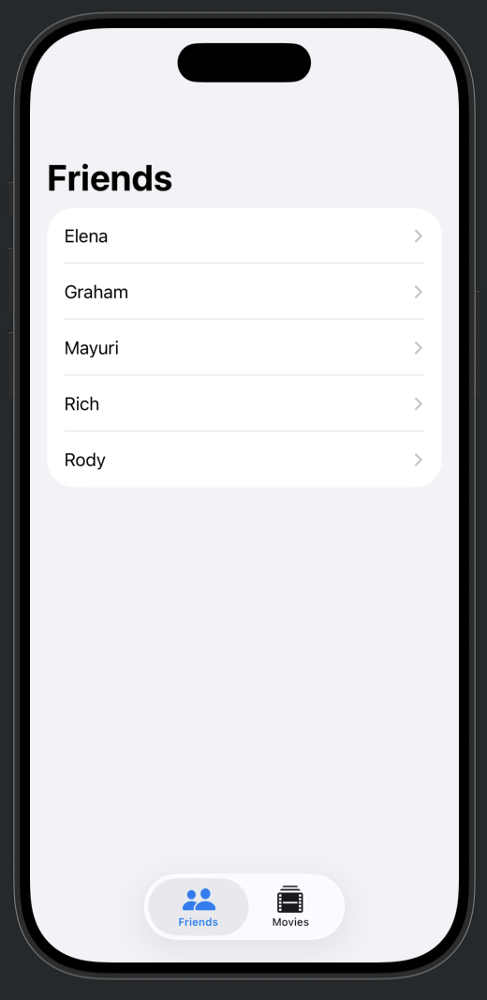
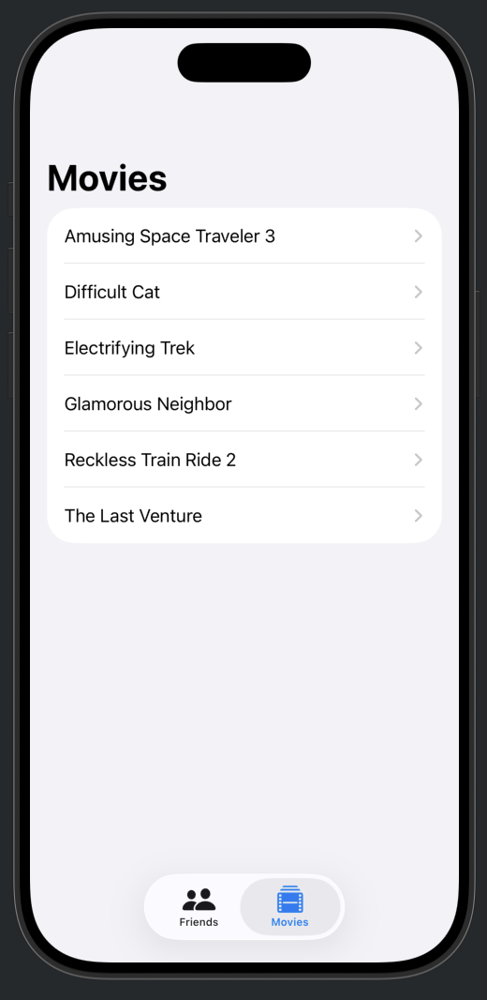

## [Data Modeling] 3-2. Navigation, edting, and relationships - Create, update, and delete data
[🔗 link](https://developer.apple.com/tutorials/develop-in-swift/create-update-and-delete-data)

---
### @Binable
- 텍스트 필드와 같은 컨트롤에 해당 속성이나 그 안에 있는 속성에 바인딩을 전달할 수 있음
- 개발자 : 'class 타입인 @Bindable 모델을 바인딩하고 있구나' 

**@Binding** = 값을 연결
**@Bindable** = 객체, 모델 전체를 연결 (SwiftData, Observation)
- 이 객체의 프로퍼티들을 바인딩 가능하게 만든다

### .interactiveDismissDisabled()
시트를 드래그하지 못하게
- 사용자가 내가 만든 cancel/save 버튼으로만 움직일 수 있도록
- 사용자가 시트를 그냥 드래그해버리면 이게 cancel/save인지 알 수 없으니까

---

## Preview

  
  
  
  

