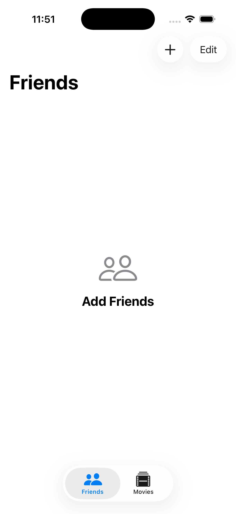
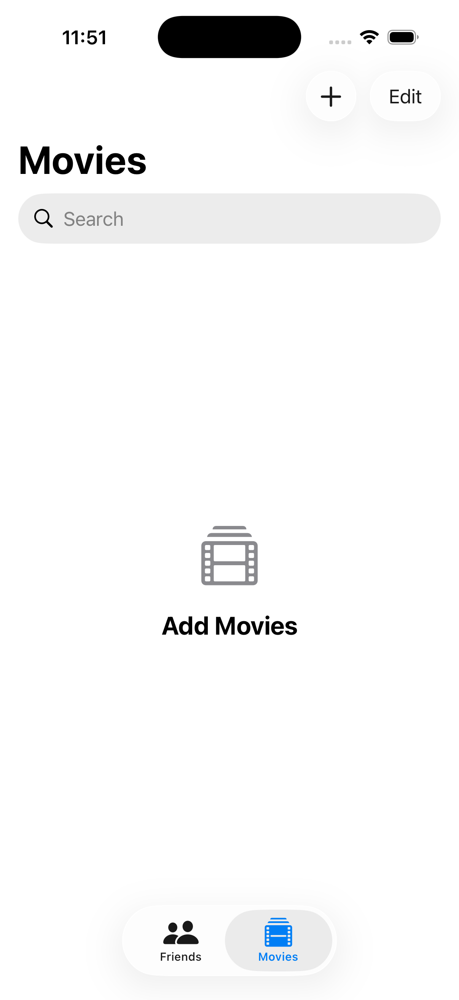
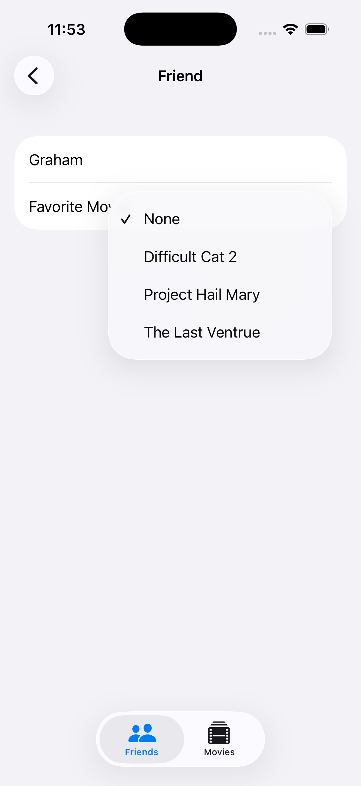
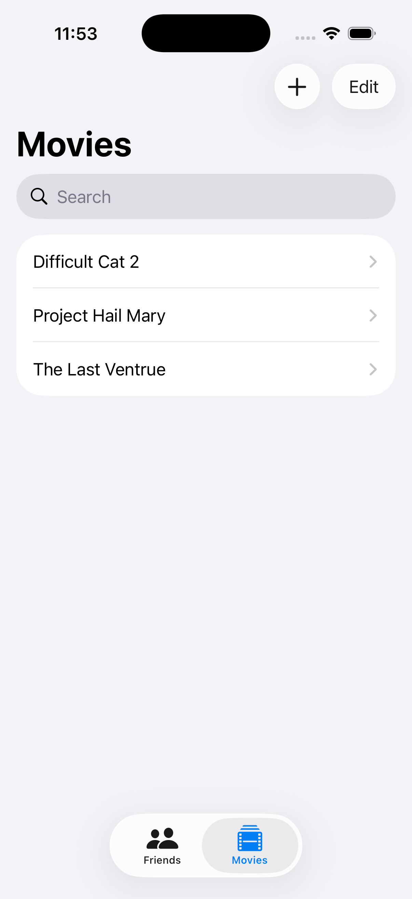
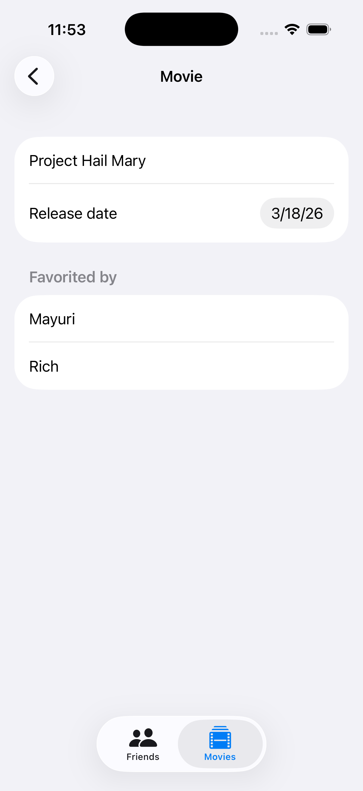
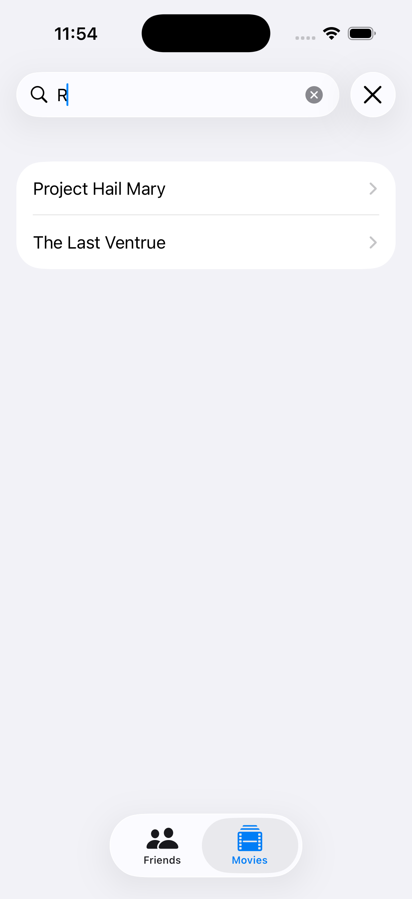

## [Data Modeling] 3-2. Navigation, edting, and relationships - Work with relationships
[🔗link](https://developer.apple.com/tutorials/develop-in-swift/work-with-relationships)


---
```
Text("None") 
    .tag(nil as Movie?)
```
Because the tag is `nil`, SwiftUI sets `friend.favoriteMovie` to `nil` when people select this item. But `nil` can refer to an optional of any type, so you still need to cast it to `Movie?`.
좋아하는 영화는 있을 수도 있고 없을 수도 있으니까!


### predicate
A logical condition used to test a set of input values for searching or filtering.
- SwiftData에서 데이터를 필터링하기 위한 조건을 설명하려면 술어(predicate)를 사용합니다. 쿼리(Query)는 데이터 저장소의 각 항목에 술어를 적용합니다. 술어가 true를 반환하면 해당 항목을 표시하려는 것을 의미합니다.
- SwiftData에서 데이터를 필터링하기 위한 조건을 설명하는 것. predicate가 true return 시 해당 항목 표시
- (ex. SQL WHERE절 = #predicate)
```#Predicate<모델타입> { 조건 }```
[참고] [Apple Developer Documentation](https://developer.apple.com/documentation/foundation/predicate)


### .searchable
- 해당 모디파이어를 통해 검색 바 생성 가능 (앞에서 걸어둔 필터를 활용해 검색)
```
    init(titleFilter: String = "") {
        // 필터링을 위한 조건
        let predicate = #Predicate<Movie> { movie in
            titleFilter.isEmpty || movie.title.localizedStandardContains(titleFilter) //대소문자 및 발음 기호 구분 없이 주어진 문자열이 포함되어 있는지 여부 반환
        }
        
        _movies = Query(filter: predicate, sort: \Movie.title)
    }
```
[참고] [Apple Developer Documentation](https://developer.apple.com/documentation/SwiftUI/Adding-a-search-interface-to-your-app)


### ContentUnavailableView
An interface, consisting of a label and additional content, that you display when the content of your app is unavailable to users.
- 데이터가 없을 때 노출되는 화면 (ex. 데이터를 추가해보세요!)
[참고] [Apple Developer Documentation](https://developer.apple.com/documentation/swiftui/contentunavailableview)


---

## Preview
<p align="center">
  
  
  
  
  
  
</p>
