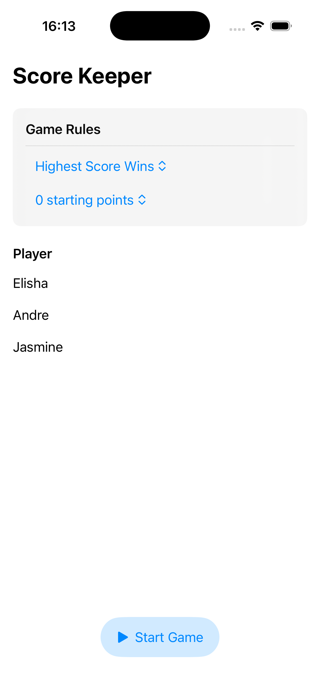
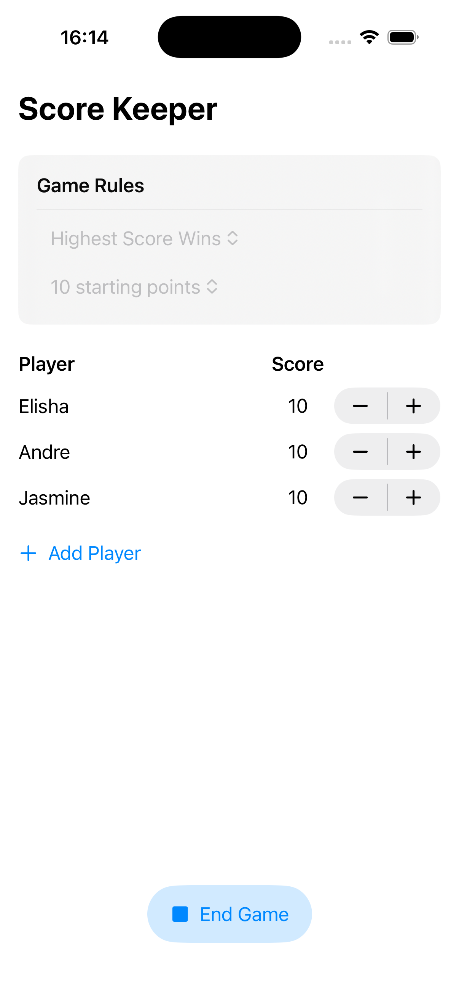
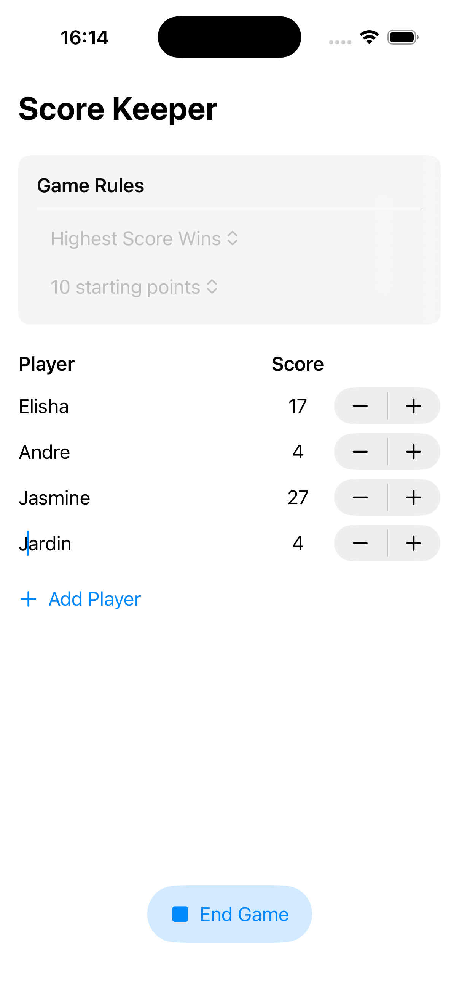
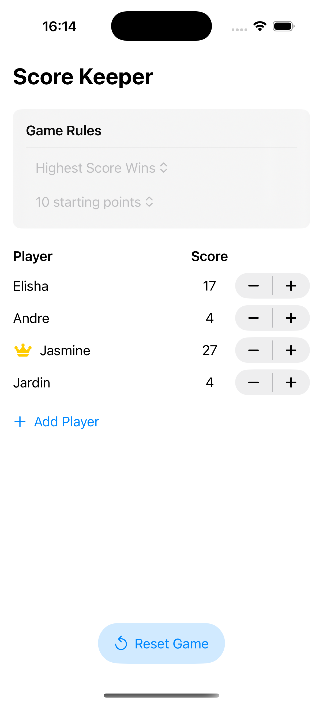

## [Data Modeling] 1-2. Add functionality with Swift Testing
https://developer.apple.com/tutorials/develop-in-swift/add-functionality-with-swift-testing

### mutating
struct의 method가 self(인스턴스)를 수정할 때 필수!
For struct types, you mark any methods that might change the properties of that struct with the mutating keyword.

### Swift Testing
Unit Test Target
테스트 코드만 따로 모아놓는 실행 환경
앱 실행 없이 코드만 테스트! 로직 테스트. 단위 테스트
- @Test | 이 함수를 test method로 표시. 하나의 테스트 케이스
- test product는 app product와 분리되어 있음. 그래서 app을 import해야 함
`@testable import ScoreKeeper`
- #expect | swift testing의 assertion (검증문). 값이 기대한 조건을 만족하는지 검증

[참고] https://developer.apple.com/documentation/xcode/testing

### @Previewable 매크로
- #Preview body 내에서 @State property를 선언할 수 있게 해줌

### Equatable 프로토콜
- 같다, 다르다를 판단할 수 있게 만들어 줌
- Swift automatically provides an implementation that compares all properties of the type and returns true if they’re equal. 

### Others
- lhs : lefthand side / rhs : righthand side

## Preview

  
  
  
  

